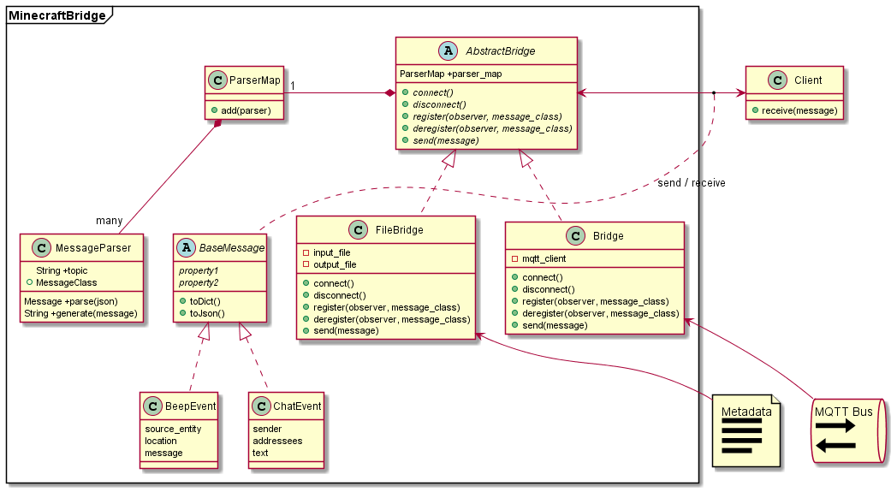

Architecture
============

The purpose of the `MinecraftBridge` package is to decouple messages generated from Minecraft (nominally with the ASISTMod) and consumers of the messages.  The package employs a `Bridge Pattern`_ to allow client code to interface with a consistent and stable set of message classes, as opposed to directly interacting with low-level messages and connections.  The benefits to this include

1.  Client code can be developed independent of the source of messages.

2.  Changes to message formats can be resolved with bridge parsers, while maintaining the same message class interface, requiring no modification of client code.

3.  Multiple clients can be attached to a single bridge, allowing one-to-many dependencies.

4.  New bridges can be created to handle different methods to connect to or simulate Minecraft environments.

Class Diagram
-------------

The basic class diagram for MinecraftBridge is shown in :numref:`bridge_class_diagram_figure`.  The package consists of two main categories of classes:  the `Bridge` classes (`AbstractBridge`, `Bridge` and `FileBridge` in :numref:`bridge_class_diagram_figure`), and the `Message` classes.  

.. _bridge_class_diagram_figure:

   Simplified class diagram of MinecraftBridge showing major components and concrete implementations.

The `Bridge` class is used to connect to an arbitrary Minecraft backend, and convert output of the connection to common `Message` objects.  Note that `AbstractBridge` is not currently implemented, but is included to demonstrate a common interface for *all* Bridge classes, and should be considered the means for client interaction (i.e., clients should not rely on specific concrete implementations).  Bridge classes implement 

All `Message` classes inherit from a `BaseMessage` class, which defines `toDict` and `toJson` to convert messages to dictionary and JSON string formats, respectively, and a `header` attribute and `addHeader` method for adding backend-specific header information.  In practice client code should identify the *type* of message based on the class of the object (queried using, e.g., `message.__class__`), and handle the messages according to type.

Bridge Pattern:: https://refactoring.guru/design-patterns/bridge