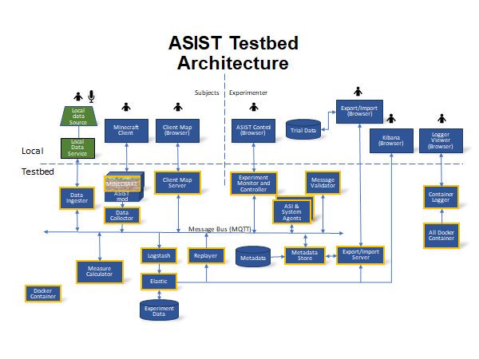

# Minecraft Testbed

This testbed has been forked from the original ASIST Study 3 testbed
(https://gitlab.com/artificialsocialintelligence/study3).

# ASIST

The objective of this project is to design and build a generalizable, cloud
testbed suitable for experimentally evaluating the performance of AI and
AI + Human collaborations.

This material is based upon work supported by the Defense Advanced Research Projects Agency (DARPA) under Contract No. HR001119C0130.

### Release notes

For a history of contribution to the testbed and it's components, please read the release notes found in `releaseNotes.md`

### To build the testbed

Follow the instructions in `Local/README_docker_build.md`.

Note: Running the core testbed on a single computer can be computationally taxing.  Running the full testbed with all Artificial Social Intelligence (ASI) components and analytical components (AC) is likely not possible on one standard machine.

To run just the core testbed - without ASI agents and AC's - it is recommended you have at least 64GB of RAM and 16 CPUs.

To run the full testbed - which includes 1 ASI running at a time + all AC's - it is recommended you have 128 GB of RAM and 32 CPUs.

The latter was acheived by utilizing high spec cloud servers, but can also be acheived with multiple machines sharing a subnet.

### To launch the testbed

Follow instructions in `Local/README_local_setup.md`.

### Installing the Minecraft client

See `docs/ClientSetup.md` for instructions on how to set up the client.

### Developing Agents and Analytic Components
See [Agent Development Guide](Agents/agent_dev_guide.md)

### The ASIST system diagram:
 

### Mission Information
See `MissionInfo/Mission_Information.md`
