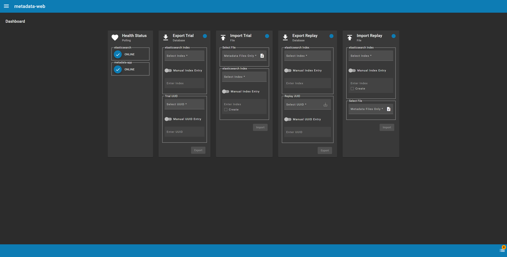

# metadata-web

A GUI front end web application for managing and interacting with ASIST metadata.

## Prerequisites
- Docker and Docker Compose.
- Google Chrome

## Starting the Application

Launch the application with **docker-compose**: `docker-compose up -d --build`

## Application Sections
- Dashboard
- Experiments
- Trials

## Dashboard

   
   ### Health Status
   Online/Offline status of the following services (necessary to perform an import or export). When service is online the corresponding circle will be _blue_. When the service is offline the circle with be _orange_.
   #### _elasticsearch_
   * all trial log data is located in this database.
   #### _metadata-app_
   * the metadata database where experiment and trial data is located. 
     * _mqtt_: metadata mqtt connection.
     * _postgres_: metadata database connection.
  
   ### Export Trial
   Current support is for exporting `msg.trial_id` data from elasticsearch. If both Health Status services are online the **Export** icon will be _blue_ otherwise it will be _orange_.
   The exported file uses the following extension when _Manual Index Entry_ is not selected. Otherwise, the `*.metadata` extension will be used.

   **File Extension:** `TrialMessages_CondBtwn-<trial condition>_CondWin-<experiment mission>-StaticMap_Trial-<trial number>_Team-na_Member-<trial subjects>_Vers-<testbed version>`

   #### elasticsearch Index
   The elasticsearch index in which the `msg.trial_id` query will take place.
   * _Index Selection_: This dropdown contains all the indices that are currently available in elasticsearch.
     * Only available when _Manual Index Entry_ is not selected.
   * _Manual Index Entry_: Selecting this will allow for manually entry of the index name.
     * This will disable the _elasticsearch Index_ dropdown and enable the _Index_ input field.
   * _Index_: Input field for manually entering the elasticsearch index name to use.
     * Only available when _Manual Index Entry_ is selected.
   
   #### Trial UUID   
   The trial uuid is the value of `msg.trial_id` used in the query.
   * _Trial UUID_: The dropdown contains all the trials that exist in the metadata database.
     * Only available when _Manual UUID Entry_ is not selected.
   * _Manual UUID Entry_: Selecting this will allow for manually entry of the trail UUID.
     * This will disable the _Trial UUID_ dropdown and enable the _UUID_ input field.
   * _UUID_: Input field for manually entering the trial UUID to use.
     * Only available when _Manual UUID Entry_ is selected.

   ### Import Trial
   Current support is for importing a previously exported `*.metadata` file. If both Health Status services are online the **Import** icon will be _blue_ otherwise it will be _orange_.
  
   #### Select File
   
